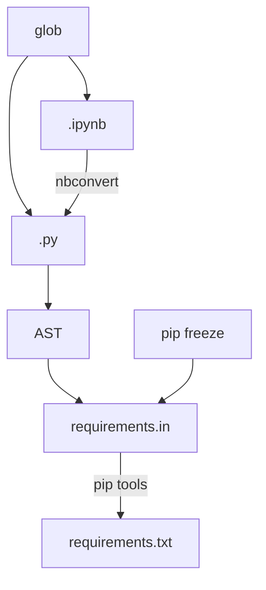

# Did I forget any imports?

DIFAI searches for import statements for all the python and jupyter notebook files in the current directory. It then uses `pip freeze` to get your installed versions and `pip-compile` to generate a `requirements.txt` file containing all of your dependencies and their depdendencies including hashes for a reproducible build.

## Run

Simply call `difai` in the current folder.
You can change the input (where the `.py` and `.ipynb` files are read) and output (where the `requirement.in` and `requirements.txt` files are written) folders using
`--in-path` and `--out-path` respectively.
In order to exclude certain packages from the search, you can use the `--exclude` option.

## Pipeline

